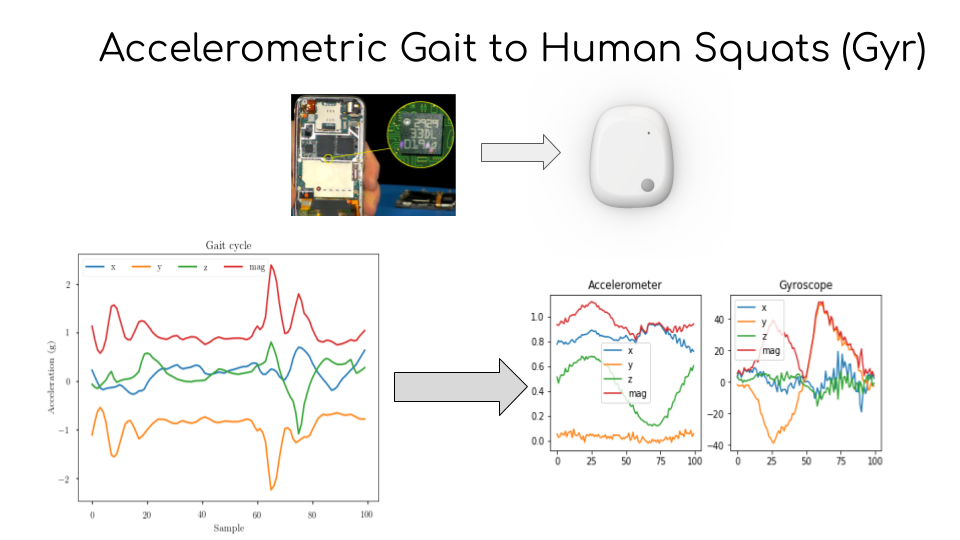

# GaitID-2-SquatID
## Accelerometric time series transfer learning





Bibtex entry:
```latex
@misc{PrabhuTietz19,
  title={Classifying humans using Deep time-series transfer learning : accelerometric gait-cycles to gyroscopic squats},
  author={Vinay Prabhu, Stephanie Tietz , Anh Ta},
  year={2019},
  publisher={KDD workshop on Mining and Learning from Time Series (MiLeTS)}
}
```


